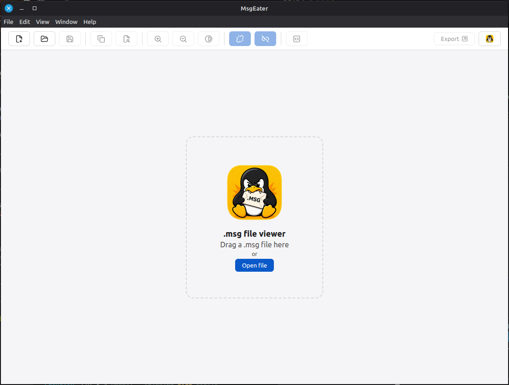

# MsgEater

<p align="center">
  <a href="https://github.com/oscarhenriquezg/msgeater/actions/workflows/ci.yml"></a>
  <a href="https://github.com/oscarhenriquezg/msgeater/actions/workflows/codeql.yml"></a>
  <a href="https://scorecard.dev/viewer/?uri=github.com/oscarhenriquezg/msgeater"></a>
  <a href="https://github.com/oscarhenriquezg/msgeater/releases/latest"></a>
  <a href="LICENSE.md"></a>
</p>

<p align="center">
  
</p>

Visor de escritorio ligero y multiplataforma (**Linux y macOS**) para archivos
`.msg` de Microsoft Outlook. Funciona **100% offline**: el contenido del correo
nunca abandona tu equipo.



## Motivación

En macOS y Linux no hay forma nativa de abrir un `.msg` recibido desde un
entorno corporativo Windows/Outlook. El escenario es habitual: un ticket de
soporte, un correo reenviado por un compañero, un adjunto en un sistema de
gestión de trabajo… y ahí está, un `.msg` que tu sistema no sabe abrir.

Las alternativas existentes no resuelven bien el problema:

- **Instalar Outlook** no es una opción en Linux, y en macOS implica una
  suscripción a Microsoft 365 solo para leer un archivo suelto.
- Los **visores de escritorio** que sí existen suelen romper el formato del
  mensaje (pierden el HTML original, muestran cabeceras a medias), no
  muestran los adjuntos correctamente o son proyectos abandonados/inseguros
  que ejecutan el contenido del correo sin sanitizar.
- Los **conversores y visores online** son, quizás, lo peor de todo: subes un
  correo (a veces confidencial, con datos de clientes o de la empresa) a un
  servidor de terceros del que no sabes nada. ¿Qué hacen con el contenido?
  ¿Cuánto tiempo lo guardan? Las direcciones de correo que extraen
  probablemente terminan alimentando bases de datos de spam, los adjuntos
  quedan expuestos a poder ser copiados o filtrados, y el cuerpo del
  mensaje —que puede contener información sensible— pasa a estar al alcance
  de quien sea que opere ese servicio. A esto se suma que subir un correo
  corporativo a una herramienta no autorizada suele violar directamente las
  políticas de manejo de datos de la empresa, y que muchos de estos sitios
  se sostienen con publicidad agresiva o directamente son una fachada para
  instalar otro software: el "visor gratis" es, en realidad, el producto que
  monetiza tu correo.

MsgEater nace del hartazgo con todo esto: la desconfianza hacia un formato
cerrado y propietario como `.msg`, y la falta de una alternativa decente,
abierta y segura para leerlo sin ceder el control de esos datos a nadie. De
ahí también el nombre y el icono: un Tux que se come los `.msg` para
digerirlos —parsearlos, sanitizarlos— y mostrarlos sin que salgan de tu
equipo.

## Características

### 📬 Visualización

| Característica | Detalle |
|---|---|
| **Formatos de entrada** | `.msg` (Outlook), `.eml` (RFC 5322) y `.emlx` (Apple Mail), con **detección por contenido** (una extensión renombrada se abre igual) |
| **Metadatos completos** | Asunto, remitente, destinatarios (Para/CC/CCO), fechas de envío y recepción |
| **Cuerpo en cascada** | HTML nativo → RTF des-encapsulado (recupera el HTML original de Outlook) → RTF aproximado → texto plano |
| **Imágenes incrustadas** | Las `cid:` se renderizan en su posición; las remotas se bloquean (placeholder) y solo se cargan con un clic, tras un aviso de rastreo |
| **Mensajes anidados** | Un `.msg`/`.eml` adjunto se abre en **ventana propia** para comparar lado a lado |
| **Direcciones de Exchange** | Resuelve el SMTP real en vez del DN X.500 interno (`/o=ExchangeLabs/...`) |
| **Idioma y tema** | Español/inglés según el sistema · claro/oscuro automático |

### 🔒 Seguridad y privacidad

| Característica | Detalle |
|---|---|
| **Contenido hostil** | El cuerpo se sanitiza (DOMPurify) y se aísla en un iframe sandbox sin scripts + CSP restrictiva |
| **Sin red** | Cero tráfico saliente automático: bloqueo en capa de sesión (verificable con `tcpdump`), cero telemetría. La única excepción es la descarga de una imagen remota que tú pidas explícitamente |
| **Imágenes remotas** | Bloqueadas por defecto. Al pulsar el placeholder, un aviso explica el rastreo (píxel de seguimiento: IP, fecha/hora de lectura) antes de descargarla |
| **Anti-phishing** | La URL real de cada enlace se ve al pasar el cursor; el clic exige confirmar antes de salir al navegador, y si el enlace es engañoso la propia advertencia lo explica |
| **Enlaces engañosos** | Resaltado opcional de los enlaces cuyo texto aparenta un dominio distinto al destino real (`<a>paypal.com</a>` → `evil.com`) |
| **Unlink** | Un botón deja todos los enlaces inertes (tachados) para inspeccionar correos sospechosos sin riesgo |
| **Adjuntos bajo control** | Solo se escriben a disco por acción explícita; los temporales de "Abrir" se purgan al salir |

### 🛠️ Acciones y exportación

| Característica | Detalle |
|---|---|
| **Barra de herramientas** | Iconos [Lucide](https://lucide.dev): Nuevo · Abrir · Guardar como · Copiar · Buscar · zoom del cuerpo · oscurecer el cuerpo · Unlink · resaltar enlaces engañosos · código fuente · Exportar · Acerca de (Imprimir sigue en el menú, Ctrl+P) |
| **Exportar** (9 formatos) | **PDF** (A4/Carta), **EML**, **PNG** (+copiar al portapapeles), **HTML**, **TXT**, **Markdown**, **MHT** (web con imágenes embebidas), **JSON** (pipelines) y **ZIP** (correo + metadata + cuerpos + adjuntos) |
| **Guardar como…** | Un diálogo con **los mismos formatos que Exportar** (+ el original); el formato se decide por la extensión elegida (Ctrl+S) |
| **Copiar con formato** | Copia la selección (o todo el cuerpo) conservando texto enriquecido e imágenes |
| **Adjuntos arrastrables** | Arrastra un adjunto fuera de la app para soltarlo en el gestor de archivos o en un correo nuevo |
| **Accesibilidad** | Zoom del cuerpo y modo de alto contraste (fondo oscuro, texto claro) independientes de la ventana |
| **Imprimir** | Diálogo del sistema sobre el mensaje y su cabecera (Ctrl+P) |
| **Búsqueda** | En el cuerpo (Ctrl+F): resaltado, contador y desplazamiento a la coincidencia |
| **Adjuntos** | Clic para Abrir con la app predeterminada o Guardar; "Guardar todos" con integridad verificada |
| **Copiar** | Direcciones con un clic (o todas por campo) · metadatos como texto o JSON |
| **Archivos recientes** | Últimos 10, persistentes, en el menú Archivo |
| **Asociación con el SO** | Diálogo para elegir qué tipos (.msg/.eml/.emlx) abre la app (Linux vía xdg-mime; macOS guía de Finder) |

### 🔬 Análisis técnico (vista de código fuente)

| Característica | Detalle |
|---|---|
| **Resaltado de sintaxis** | Cabeceras, etiquetas/atributos HTML y bloques base64, con búsqueda, copiar, imprimir y exportar |
| **Ruta del mensaje** | Cadena `Received` cronológica con la **demora entre saltos** y resultados **SPF/DKIM/DMARC** |
| **Decodificador** | Selecciona base64 o quoted-printable y lo descodifica en el sitio |
| **Propiedades MAPI crudas** | Tabla completa de PidTag del `.msg` (forense) |
| **Diff de sanitización** | Lista exacta de scripts/manejadores que el correo traía y se eliminaron |

## Instalación

### Instalación rápida (una línea)

Funciona en **Linux y macOS**; el script detecta el sistema y descarga el artefacto adecuado. Si ya tienes una versión instalada, la actualiza (y si venías de un método distinto al que le toca ahora a tu distro, te ofrece limpiar el anterior para no duplicar la entrada en el menú):

```bash
bash -c "$(curl -fsSL https://raw.githubusercontent.com/oscarhenriquezg/msgeater/main/scripts/install.sh)"
```

- **Linux** — detecta la familia de tu distro: `.deb` en Debian/Ubuntu/Mint…, `.rpm`
  en Fedora/RHEL/openSUSE… (ambos vía el gestor de paquetes del sistema, piden
  sudo). Si no reconoce ninguna de las dos, cae al AppImage en `~/.local/bin`
  con su propia entrada de menú (sin root).
- **macOS** — instala `MsgEater.app` en `~/Applications` y le quita la cuarentena de Gatekeeper (la app no está firmada).

> En Linux, si termina usando el AppImage, este requiere **FUSE2** (`libfuse2`).
> Si al arrancar ves un error de FUSE, instálalo (`sudo apt install libfuse2` /
> `sudo dnf install fuse fuse-libs`) o ejecuta con
> `~/.local/bin/MsgEater.AppImage --appimage-extract-and-run`.

### Descarga manual (y verificable)

La instalación rápida de arriba prioriza comodidad. Si prefieres comprobar
tú mismo que el binario corresponde exactamente al código de este repo antes
de ejecutarlo, descarga manualmente desde
[Releases](https://github.com/oscarhenriquezg/msgeater/releases) — cada
release incluye `SHA256SUMS` y una
[GitHub Artifact Attestation](https://docs.github.com/actions/security-guides/using-artifact-attestations-to-establish-provenance-for-builds)
firmada (Sigstore) por artefacto. Los pasos completos, con comandos para
Linux y macOS, están en **[docs/VERIFY-RELEASE.md](docs/VERIFY-RELEASE.md)**.

**Linux** — AppImage (recomendado, cualquier distro con glibc ≥ 2.35), `.deb` o `.rpm`:

```bash
chmod +x "MsgEater-x.y.z-x86_64.AppImage"
./"MsgEater-x.y.z-x86_64.AppImage" correo.msg
```

**macOS** — monta el `.dmg` y arrastra la app a Aplicaciones (macOS 12+, binario universal).

> **App sin firmar:** MsgEater es gratuita (GPL) y no está firmada ni
> notarizada por Apple (el Developer Program cuesta 99 USD/año). macOS la
> bloqueará la primera vez con un aviso de desarrollador no identificado. Para
> abrirla:
>
> - **Opción A:** clic derecho sobre la app → **Abrir** → confirma **Abrir** en
>   el diálogo. Solo hace falta la primera vez.
> - **Opción B (Terminal):** quita el atributo de cuarentena y ábrela normal:
>
>   ```bash
>   xattr -dr com.apple.quarantine "/Applications/MsgEater.app"
>   ```
>
> Esto **no es inofensivo por definición**: `xattr -dr com.apple.quarantine`
> desactiva parte del flujo normal de Gatekeeper para esa app, y solo tiene
> sentido como workaround mientras no exista firma/notarización real. El
> código es abierto y auditable, y puedes verificar el binario con los pasos
> de arriba antes de aplicarlo — pero la afirmación correcta es esa, no que
> "no compromete la seguridad". Se retirará esta indicación en cuanto haya
> firma y notarización (ver [Security & Trust](#security--trust)).

## Security & Trust

> La seguridad debe poder verificarse, no darse por sentada.

MsgEater está pensada para abrir correos potencialmente hostiles, así que la
cadena que va del código fuente al binario que ejecutas está pensada para
que un tercero pueda comprobarla — no para que confíes en la palabra del
autor:

| Control | Qué aporta |
| --- | --- |
| **Código abierto (GPL-3.0)** | Todo el código, incluido el de build y CI, es auditable |
| **100% offline, sin telemetría** | Bloqueo de red a nivel de sesión (NFR-03), cubierto por test e2e |
| **CI en cada commit** | Lint, typecheck, tests unitarios y e2e, `npm audit` de producción |
| **[CodeQL](https://github.com/oscarhenriquezg/msgeater/security/code-scanning)** | Análisis estático (SAST) oficial de GitHub sobre el código TS/JS |
| **Dependabot + Dependency Review** | Dependencias vigiladas tanto ya instaladas como al agregar una nueva en un PR |
| **[OpenSSF Scorecard](https://scorecard.dev/viewer/?uri=github.com/oscarhenriquezg/msgeater)** | Evaluación independiente de prácticas de seguridad del repositorio |
| **SHA-256 (`SHA256SUMS`)** | Cada release permite comprobar que el archivo descargado es *byte a byte* el publicado |
| **SBOM (SPDX)** | Inventario firmado de qué depende cada release, con versiones |
| **GitHub Artifact Attestations** | Prueba criptográfica (Sigstore) de que el binario salió de este repo y este commit — no de un tercero |

Ninguno de estos controles por separado — ni siquiera todos juntos —
significa "100% seguro"; cada uno demuestra algo puntual y verificable. El
detalle de qué prueba cada uno está en
**[docs/VERIFY-RELEASE.md](docs/VERIFY-RELEASE.md)**, y el modelo de
protección en tiempo de ejecución (sandbox, sanitización, bloqueo de red)
está en **[SECURITY.md](SECURITY.md)**.

## Limitaciones conocidas (por diseño)

| | |
|---|---|
| RTF→HTML aproximado | Si el mensaje solo trae RTF puro (sin HTML nativo ni encapsulado), la conversión es una aproximación. |
| EML reconstruido | El EML se genera desde las propiedades MAPI; no es byte-equivalente al mensaje SMTP original. |
| Imágenes remotas | Bloqueadas por defecto (placeholder); cargables con un clic tras un aviso de rastreo. Las incrustadas sí se muestran. |
| PNG ≤ 20.000 px | Para correos más largos, la app ofrece truncar o sugiere PDF. |
| Tipos no soportados | Citas, contactos y tareas se informan como no soportados; S/MIME cifrado no puede mostrarse; las firmas se indican pero no se verifican. |

## Desarrollo

```bash
npm install
npm run fixtures      # genera el corpus de .msg de prueba (sintético)
npm run dev           # arranque con recarga automática
npm test              # unit tests (parser, EML, corpus adversarial)
npm run build && npx playwright test   # E2E sobre la app construida
npm run build:linux   # AppImage/deb/rpm en release/
npm run build:mac     # dmg/zip (requiere macOS)
```

Para probar con correos reales, copia archivos `.msg` a `tests/fixtures/real/`
(directorio ignorado por git): la suite los recoge automáticamente y
`npx vite-node scripts/report-real.ts` genera un informe de parseo.

### Arquitectura

Electron + TypeScript. El parsing (`@kenjiuno/msgreader` tras un adapter
propio) ocurre en un worker thread del proceso main; el renderer recibe un
documento serializado con HTML ya sanitizado y muestra el cuerpo en un iframe
sandbox sin ejecución de scripts. El bloqueo de red, los diálogos nativos y la
escritura a disco viven exclusivamente en main. Especificación completa en
[SRS-visor-msg-v0.2.md](SRS-visor-msg-v0.2.md).

## Licencia

© 2026 Oscar Henríquez. Publicado bajo la **GNU General Public License v3.0
(o posterior)**. El texto completo está en [LICENSE.md](LICENSE.md).

Política de seguridad y reporte de vulnerabilidades: [SECURITY.md](SECURITY.md).

### Software de terceros

MsgEater usa las siguientes bibliotecas de código abierto. Todas sus
licencias son compatibles con la GPL-3.0. Cada una conserva su licencia y sus
derechos de autor originales.

| Dependencia | Uso | Licencia |
| --- | --- | --- |
| [Electron](https://github.com/electron/electron) | Entorno de ejecución de escritorio | MIT |
| [@kenjiuno/msgreader](https://github.com/HiraokaHyperTools/msgreader) | Lectura de archivos `.msg` (CFBF/MAPI) | Apache-2.0 |
| [@kenjiuno/decompressrtf](https://github.com/HiraokaHyperTools/decompressRTF) | Descompresión de RTF comprimido | BSD-2-Clause |
| [rtf-stream-parser](https://github.com/mazira/rtf-stream-parser) | Des-encapsulación de HTML/RTF | MIT |
| [mailparser](https://github.com/nodemailer/mailparser) | Lectura de archivos `.eml`/`.emlx` (MIME) | MIT |
| [DOMPurify](https://github.com/cure53/DOMPurify) | Sanitización del HTML del correo | MPL-2.0 OR Apache-2.0 |
| [jsdom](https://github.com/jsdom/jsdom) | DOM para DOMPurify en el proceso main | MIT |
| [iconv-lite](https://github.com/ashtuchkin/iconv-lite) | Decodificación de juegos de caracteres heredados | MIT |
| [archiver](https://github.com/archiverjs/node-archiver) | Generación de exportaciones ZIP | MIT |
| [Lucide](https://lucide.dev) (`lucide-static`) | Iconos de la interfaz (inlineados en el build) | ISC |

> El listado completo de licencias de la cadena de dependencias —incluidas las
> de desarrollo— puede generarse con `npx license-checker --production`.
