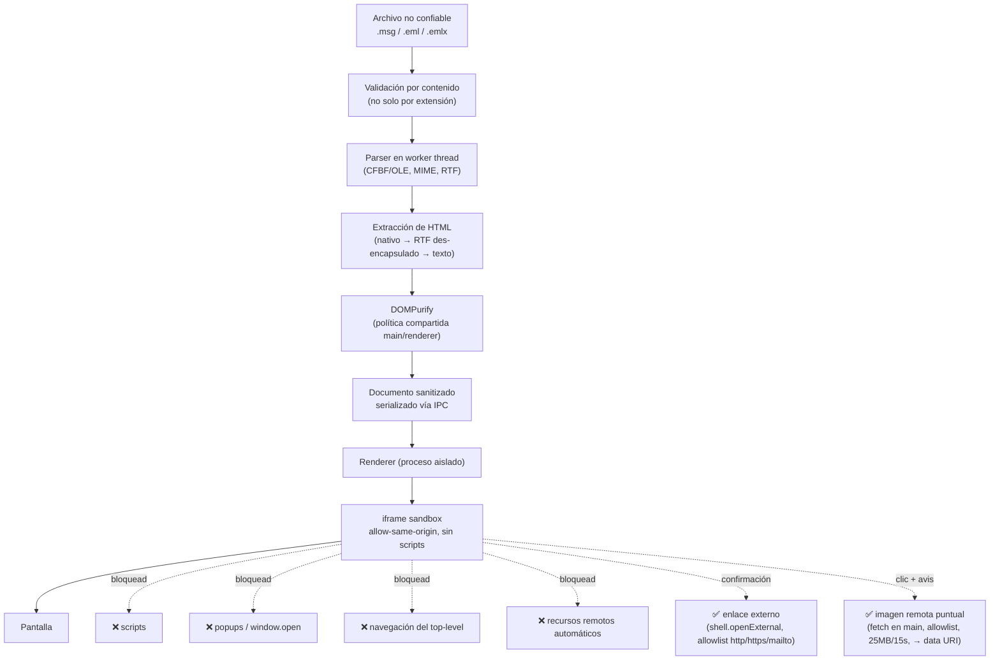

# Arquitectura de seguridad

Este documento explica cómo MsgEater procesa contenido potencialmente
hostil: un `.msg`/`.eml`/`.emlx` puede venir de cualquier parte (un ticket de
soporte, un adjunto reenviado), así que se trata como **no confiable** en
todo momento hasta que llega sanitizado a la pantalla.

No es una promesa de invulnerabilidad — es un mapa de qué protege qué, dónde
están los límites, y qué queda como riesgo residual. Para el proceso de
release (checksums, SBOM, attestations), ver
[docs/VERIFY-RELEASE.md](VERIFY-RELEASE.md). Para cómo reportar un fallo, ver
[SECURITY.md](../SECURITY.md).

## Flujo de datos

## Fronteras de confianza (trust boundaries)

| # | Frontera | Qué la protege |
| --- | --- | --- |
| **TB1** | Archivo de entrada | Nada todavía lo ha tocado: puede ser cualquier byte. Se abre por ruta (argv, diálogo, drag&drop) o buffer; nunca se ejecuta ni se interpreta directamente. |
| **TB2** | Parser (CFBF/OLE, MIME, RTF) | `@kenjiuno/msgreader`, `mailparser`, `rtf-stream-parser`, `iconv-lite`. Formatos binarios complejos con historial de parsers inseguros en el ecosistema; de ahí el corpus adversarial (`scripts/make-fixtures.mjs`: truncados, bytes aleatorios, cabeceras falsas, RTF/MIME malformado). |
| **TB3** | Worker thread ↔ proceso main | El parsing corre en un `worker_thread` separado (`src/main/parsing.ts`); un crash o cuelgue del parser no tumba la ventana ni el proceso main. Comunicación solo por `postMessage` (estructuras serializables, no referencias vivas). |
| **TB4** | IPC main ↔ preload ↔ renderer | `contextIsolation: true`, `nodeIntegration: false` en ambas ventanas. El preload (`src/preload/index.ts`) expone una API tipada mínima vía `contextBridge` (`MsgEaterApi`); el renderer no tiene `require`, `process`, ni acceso a Node. |
| **TB5** | Sanitización HTML | DOMPurify con una única política compartida (`@shared/sanitize-policy`) entre el renderer (DOM nativo, para mostrar) y el proceso main (jsdom, para la vista de código fuente/exportaciones) — evita que las dos rutas diverjan. La vista de código fuente muestra un *diff* de lo removido. |
| **TB6** | iframe sandbox del cuerpo | `sandbox="allow-same-origin"` **sin** `allow-scripts`, `allow-popups` ni `allow-top-navigation(-by-user-activation)`. `allow-same-origin` es intencional: permite que el renderer padre enganche listeners (clic, drag, `mouseover` para la barra anti-phishing) sobre `contentDocument`; como no hay `allow-scripts`, el contenido del correo no puede ejecutar nada — los listeners los pone la app, no el correo. |
| **TB7** | URLs externas | Todo enlace pasa por confirmación (`confirmLeave`) antes de `shell.openExternal`, que además revalida el protocolo (`http:`/`https:`/`mailto:` únicamente) en el proceso main — nunca se confía en lo que mande el renderer sin revalidar. |
| **TB8** | Filesystem / adjuntos | Los adjuntos solo se escriben a disco por acción explícita. `sanitizeAttachmentName` (`src/shared/attachment-name.ts`) impide path traversal/zip-slip en el nombre. Adjuntos ejecutables (`isExecutableAttachment`) piden confirmación extra antes de guardarse o abrirse. Los temporales de "Abrir adjunto" se purgan al cerrar (`will-quit`). |
| **TB9** | Red | Bloqueo por defecto a nivel de sesión (`session.defaultSession.webRequest.onBeforeRequest`, allowlist de esquema: `file:`, `data:`, `msgprint:`, `devtools:`, + servidor de dev en modo desarrollo). Única excepción deliberada: cargar una imagen remota bloqueada, solo tras clic explícito del usuario y aviso de rastreo — se hace con `fetch` en el proceso main (fuera de ese bloqueo de sesión, a propósito), con allowlist de protocolo, límite de 25 MB, timeout de 15 s, validación de `content-type`, y el resultado se entrega como `data:` URI (nunca una URL viva en el DOM). |

## Amenazas

| Amenaza | Control existente | Limitación | Riesgo residual |
| --- | --- | --- | --- |
| **HTML/JS malicioso en el cuerpo** | DOMPurify (TB5) + iframe sin `allow-scripts` (TB6): dos capas independientes | DOMPurify tiene su propio historial de CVEs (por eso se mantiene actualizado vía Dependabot/`npm audit` en CI); si fallara, el sandbox del iframe sigue bloqueando ejecución | Bajo — requeriría fallo simultáneo de sanitización *y* bypass del sandbox del navegador |
| **Tracking pixels / recursos remotos** | Bloqueados por defecto (TB9); solo con clic + aviso explícito | El aviso depende de que el usuario lo lea | Bajo — sin acción del usuario no hay fuga de IP/lectura |
| **Phishing (enlaces engañosos)** | Barra con la URL real al pasar el cursor, resaltado opcional de enlaces engañosos, confirmación antes de salir (TB7) | Es una advertencia, no un bloqueo — el usuario puede igualmente decidir abrir un enlace malicioso | Medio — depende del juicio del usuario, como en cualquier cliente de correo |
| **Adjuntos maliciosos (ejecutables, macros)** | Confirmación extra para ejecutables (`isExecutableAttachment`); nada se ejecuta automáticamente | No hay antivirus integrado; el archivo se guarda o abre con la app del SO que decida el usuario | Medio — equivalente a guardar cualquier adjunto de correo con cualquier cliente |
| **Path traversal / zip-slip en nombres de adjunto** | `sanitizeAttachmentName` en todos los puntos de escritura (guardar, exportar ZIP) | Cubierto por test dedicado y fixture adversarial (`path-traversal.msg`) | Bajo |
| **CFBF/OLE, MIME o RTF malformado (parser crash, cuelgue)** | Parsing en worker thread aislado (TB3); corpus adversarial en CI (truncados, bytes aleatorios, tamaños absurdos) | El corpus es una muestra, no una prueba exhaustiva; un parser en JS no está memory-unsafe como uno en C, pero sí puede colgarse en bucles/recursión | Medio — un crash del worker no compromete el proceso main, pero un cuelgue de CPU sigue siendo posible (ver Fase 23/fuzzing incremental en el roadmap) |
| **Mensajes/adjuntos anidados (`.msg` dentro de `.msg`)** | Profundidad máxima (`MAX_EMBEDDED_DEPTH`); cada nivel se abre en ventana propia, mismo pipeline completo | — | Bajo |
| **Decompression bombs / agotamiento de recursos** | Límites explícitos: tamaño máximo de imagen remota (25 MB), timeout de red (15 s), altura máxima de PNG en export (`MAX_PNG_HEIGHT`) | No hay límite genérico de tamaño de adjunto individual al descomprimir RTF/CFBF | Medio — un adjunto/cuerpo extremadamente grande podría degradar rendimiento antes que comprometer seguridad |
| **Escape del renderer de Electron** | `contextIsolation: true`, `nodeIntegration: false`, preload mínimo con API allowlist tipada (TB4); `setWindowOpenHandler` deniega todo | `sandbox: false` en las `BrowserWindow` (ver nota abajo) — el aislamiento de proceso a nivel SO de Chromium no está activo, solo el aislamiento de contexto JS de Electron | Medio — mitigado por las otras capas (sin scripts en contenido no confiable, sin acceso a Node desde el renderer), pero es la capa más débil actual |
| **Abuso de IPC / exposición de APIs de Node** | Preload usa exclusivamente `contextBridge.exposeInMainWorld` con una API tipada (`MsgEaterApi`); cada handler del main valida tipos y, donde aplica, protocolo/ruta antes de actuar | La validación es manual por handler, no hay un esquema declarativo centralizado | Bajo — superficie pequeña y auditada, pero requiere disciplina al añadir handlers nuevos |
| **Abuso de protocolos externos / `file://` arbitrario** | `open-external` revalida protocolo (`http:`/`https:`/`mailto:`) en main antes de `shell.openExternal`; el protocolo interno `msgprint://` ignora la ruta de la URL y solo sirve dos documentos fijos en memoria (sin acceso a filesystem) | — | Bajo |
| **Sobrescritura de archivos al exportar/guardar** | Los diálogos de guardado son nativos del SO (el usuario elige la ruta); nombres de adjunto saneados (TB8) | No hay confirmación adicional de "vas a sobrescribir X" más allá de la que ya da el diálogo nativo del SO | Bajo |

### Nota sobre `sandbox: false`

Ambas `BrowserWindow` corren con `sandbox: false` en el proceso renderer
(webPreferences), documentado en el código junto a cada creación de ventana.
Se probó `sandbox: true`: no solo falla en el contenedor de CI como se creía
originalmente, sino también en un escritorio real, con una causa raíz
identificada — el driver de Electron de Playwright lanza siempre con
`--no-sandbox` a nivel de proceso, y esa combinación con `--enable-sandbox`
(que dispara el webPreference por ventana) deja el renderer en un estado
contradictorio que cuelga. El propio arnés de e2e no puede validar
`sandbox: true` tal como está armado hoy; probarlo de verdad requeriría
lanzar la app empaquetada a mano, fuera de Playwright. Mitigación mientras
tanto: `contextIsolation: true` + `nodeIntegration: false` + preload mínimo
siguen activos, y el único contenido no confiable (el cuerpo del correo)
vive además detrás del sandbox del iframe (TB6), independiente de este.

## Decisiones evaluadas y no aplicadas (por ahora)

### Firma GPG de los paquetes Linux

Se evaluó firmar `.deb`/`.rpm`/`AppImage` con GPG además de los controles ya
activos (SHA256SUMS + GitHub Artifact Attestations). **No aporta valor real
adicional en este escenario concreto:**

- La Attestation ya prueba —criptográficamente, vía Sigstore/OIDC, sin que el
  mantenedor tenga que custodiar ninguna clave privada— que el artefacto
  salió de este repo, este commit y este workflow. Una firma GPG probaría lo
  mismo que ya prueba la Attestation, pero exige generar, publicar y rotar
  una clave privada a mano: más superficie de gestión (¿dónde vive la clave?
  ¿qué pasa si se filtra?) para la misma garantía.
- Los gestores de paquetes de las distros (`apt`/`dnf`/`zypper`) solo piden
  firma GPG si el paquete se distribuye vía un **repositorio APT/RPM propio**
  (`add-apt-repository`, `.repo` file). MsgEater no tiene uno: se distribuye
  como descarga directa desde GitHub Releases e instalado con `dpkg -i`/
  `rpm -i`, donde GPG no interviene en el flujo de instalación real.
- Si en el futuro se publica un repositorio APT/RPM propio, ahí sí GPG pasa a
  ser necesario (no opcional) porque es el mecanismo que esos gestores
  esperan — se reevaluará en ese momento, no antes.

### Reproducible builds

Se investigaron las fuentes de variabilidad de un build con
`electron-vite`/`electron-builder` para evaluar si prometer *builds
reproducibles* (que cualquiera pueda recompilar el código y obtener
bytes idénticos a los publicados) es viable a corto plazo. Honestamente, no
lo es todavía, por varias fuentes de no-determinismo reales:

- El binario de Electron descargado (`node_modules/electron`) no está fijado
  por hash, solo por versión semver del `package.json`.
- `asar: false` (necesario aquí porque el worker de parsing usa el loader
  ESM de Node, que no puede leer dentro de `.asar`) evita una fuente de
  variabilidad, pero el propio empaquetado de `electron-builder` (orden de
  archivos, metadatos de timestamps en `.dmg`/`.AppImage`) no está pensado
  para determinismo bit a bit.
- El build de macOS depende de herramientas del sistema operativo del
  runner (`hdiutil` para el `.dmg`) cuyo output no es necesariamente estable
  entre versiones de macOS.

**No se afirma reproducibilidad porque no sería cierto.** La garantía real
hoy es la cadena SHA256 + SBOM + Attestation: no prueba que *cualquiera*
pueda reconstruir el binario byte a byte, pero sí prueba de forma verificable
que el binario publicado salió de este código, en este commit, por este
workflow — que es la propiedad que de verdad importa para confiar en un
release sin confiar ciegamente en el autor.

### Estrategia incremental de fuzzing

El corpus adversarial actual (`scripts/make-fixtures.mjs`) ya cubre: CFBF
truncado, bytes aleatorios, cabecera ZIP falsa, archivo vacío, solo-cabecera,
nombre de adjunto con path traversal, RTF encapsulado/plano, ANSI/cirílico
(codepage no-UTF8), S/MIME cifrado y calendario no soportado. Gaps
identificados, en orden de prioridad para una próxima iteración:

1. **Mensajes anidados adversariales** — un `.msg` que se adjunta a sí mismo
   o se anida más allá de `MAX_EMBEDDED_DEPTH`, para confirmar que el límite
   corta la recursión en vez de solo evitarla por casualidad en los fixtures
   actuales (ninguno anida hoy).
2. **MIME anidado/multipart malformado** — `multipart/mixed` con boundaries
   rotos o anidados sin cierre, más allá del `plaintext-only`/`html-basic`
   actuales.
3. **Charsets inválidos o no declarados** — más allá de `ansi-cyrillic`
   (codepage válido pero no-UTF8): un `charset=` que no existe, o ausente
   donde se esperaba.
4. **Tamaños absurdos / decompression-bomb-ish** — un RTF o CFBF cuyo
   contenido descomprimido sea desproporcionado respecto a su tamaño en
   disco, para confirmar que no hay un límite de recursos ausente entre el
   parser y el worker thread.

No se implementa en esta pasada (no era obligatorio per el alcance original),
pero queda como lista concreta y accionable para cuando se retome.

## Qué queda fuera de este documento

- El proceso de build/release (checksums, SBOM, procedencia firmada): ver
  [VERIFY-RELEASE.md](VERIFY-RELEASE.md).
- Cómo reportar una vulnerabilidad y qué versiones reciben parches: ver
  [SECURITY.md](../SECURITY.md).
